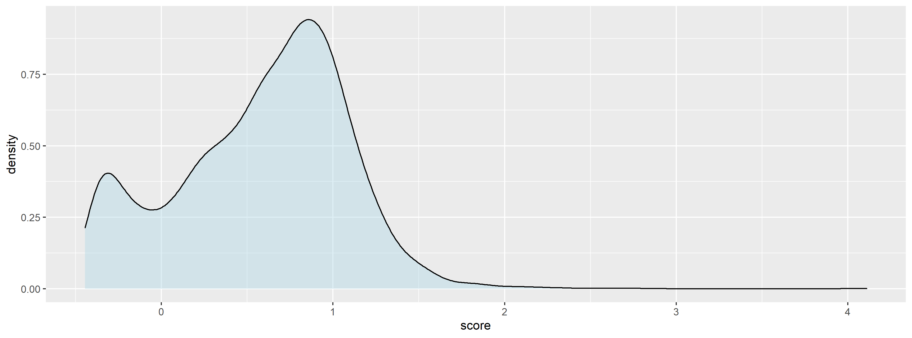
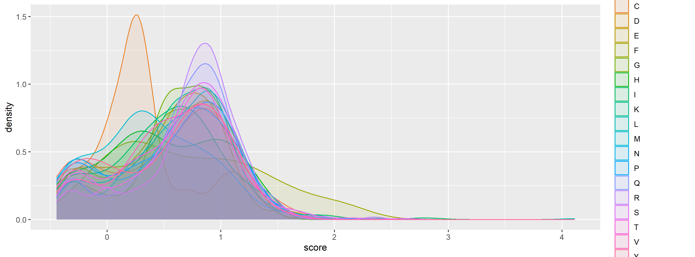
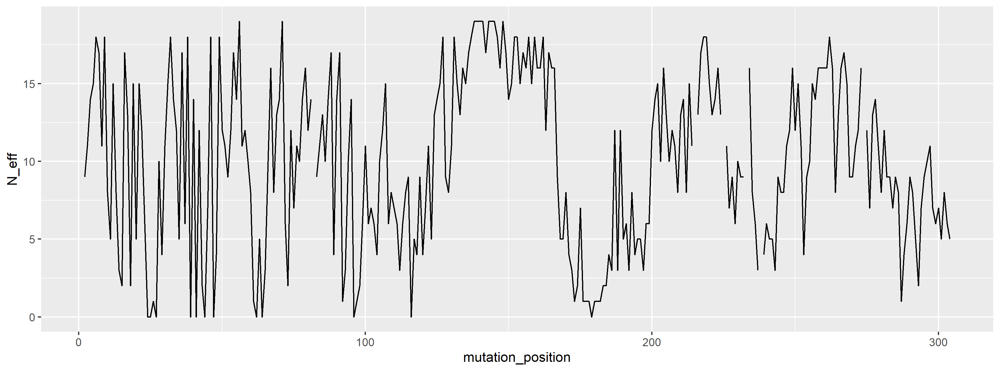
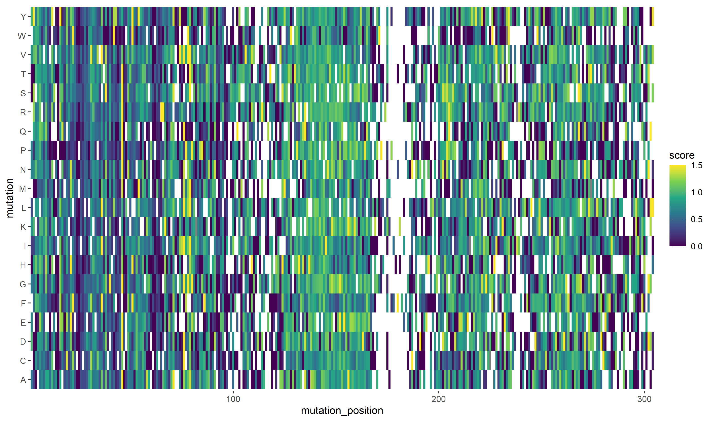

```{r setup, include=FALSE}
knitr::opts_chunk$set(echo = FALSE)
```

<style>
.forceBreak { -webkit-column-break-after: always; break-after: column; }
</style>

<style>
div.footnotes {
  position: absolute;
  bottom: 0;
  margin-bottom: 10px;
  width: 80%;
  font-size: 0.6em;
}
<<<<<<< HEAD
div.columns-2{
  margin-bottom: -20px;
  margin-right: 20px;
  margin-top: -10px;
}
=======
</style>


## Project aims

* Produce R script machine learning toolbox for protein and peptide bio-activities.
* Features:
  - Support for both sequence or variant input.
  - Support for several sequence encoders.
  - Support for sequence based calculations.
  - Support for several models.
  - Visualization options.

## Example dataset 2 - data overview
<div class="columns-2">
  {width=100%}
  <p class="forceBreak"></p>
  {width=100%}
</div>


## Example dataset 1 - heatmap
{width=100%}

</div>
{width=100%}
  
## R script overview 2

<div class="columns-2">
  {width=500px}
  <p class="forceBreak"></p>
  * 02_clean.R
    - Load: Load data from 01_load.R
    - Wrangle data: Remove NaN, fixes
    - Save cleansed data in .tsv format
  * 03_augment.R
    - Load data from 02_clean.R
    - Augment data: Calculate sequences, descriptors, properties
    - Save augmente data in .tsv format
</div>
    
## R script overview 3

<div class="columns-2">
  {width=500px}
  <p class="forceBreak"></p>
  * 04_model_i.R
    - Load augmented data
    - Perform model fitting
    - Predict unknowns
    - Plotting and reporting
</div>

## R script overview 4

<div class="columns-2">
  {width=500px}
  <p class="forceBreak"></p>
  * 99_proj_func.R
    - Sequence encoder
    - Sequence generator
    - ...
</div>

## Data peptide and protein data sources

* Ideas for sequence / variant effects:
  - https://www.mavedb.org/ is a public repository for datasets from Multiplexed Assays of Variant Effect (MAVEs), such as those generated by deep mutational scanning (DMS) or massively parallel reporter assay (MPRA) experiments. RESTful API.
  - Other scientific litterature...

* Ideas for sequence encoding matrices
  - BLOSUM - Physicochemical and substitution matrix
  - Z-scales - Physicochemical
  - T-scales - Topological
  - MSWHIM - 3D electrostatic potential

## Machine learning toolbox

* Ideas for supported machine learning framework:

  - Gaussian Process Regression.
  - Artificial Neutral Network.
  - ElasticNet Regression.

## Distribution of tasks, week 18

* Laura: Descriptors and function for translating, data visualization / exploration
* Jacob: Sequence generation
* Felix, Begoña: Machine learning tool boox

* Project state EOW - functional preprocessing, first steps with machine learning toolbox

## Distribution of tasks, week 19

# final presentation 
>>>>>>> 36ceb0aa2e409c7ac33a5ca61c3ea263ef23a54b

</style>

## Content

* Introduction
* Methods
* Results
* Discussion
* Conclusion

## Introduction


## Introduction
Prediction of protein-protein interactions (PPI) are a challenging task. 

ML models allow to exploit the content of these PPI data sets. 

The aim of this project is to create a toolbox to predict the biological activity of these peptides with machine learning models. 

* Features:
  - Support for both sequence or variant input.
  - Support for several sequence encoders.
  - Support for several models.
  - Visualization options.

## Methods - the data sets

|            | Protein | Target                     | Biological activity    | Species         | Num of variants | Score                                                     |
| ---------- | ------- | -------------------------- | ---------------------- | --------------- | --------------- | --------------------------------------------------------- |
| Data set 1 | BRCA1   | BARD1 RING domain          | Ubiquitin E3 activity  | *H. sapiens*    | 5610            | Y2H assays                                                |
| Data set 2 | ERK2    | Small molecule (SCH772984) | Resistance to drugs    | *H. sapiens*    | 6810            | Drug sensitivity assays. Calculation of cell availability |
| Data set 3 | LDLRAP1 | OBFC1                      | Protein translation    | *H. sapiens*    | 6385            | Y2H assays                                                |
| Data set 4 | Pab1    | el4FG1                     | Translation initiation | *S. cereviseae* | 1340            | Y2H assays                                                |

## Methods - packages used


Dataset used
libraries used
data cleaning and data wrangling
data visu (only mention it, more in results)
modelling (how, train set, test set, models regression, ann...)


## Results
data visu (some plots to show the distribution of the initial data, LAURA WILL DO IT)
basic statistics for the data we have (LAURA WILL DO IT)
models results

## Discussion

## Conclusion

## References {#ID_ref}

<style> 
  #ID_ref > p { 
    margin-bottom: -500px; 
    margin-right: 100px; 
  } 
</style>

<div class="columns-2">
  {width=300px}
  <p class="forceBreak"></p>

  * <font size="3">**Data set 1**: L. M. Starita,  D. L. Young, et al. *Massively parallel functional analysis of brca1 ring domainvariants*, Genetics, vol. 200, no. 2, pp. 413–422, 2015.  </font>
  * <font size="3">**Data set 2**:  L. Brenan, A. Andreev, et al. *Phenotypic  characterization  of  a  comprehensive  set  of missense mutants*. Cell Reports, vol. 17, no. 4, pp. 1171–1183, 2016.  </font>
  * <font size="3">**Data set 3**: A deep mutational scan of LDLRAP1 based on a Y2H assay with the interactor OBFC1. [https://www.mavedb.org/scoreset/urn:mavedb:00000036-a-1/]   </font>
  * <font size="3">**Data set 4**: D. Melamed, D. L. Young, et al. *Combining natural sequence variation withhigh throughput mutational data to reveal protein interaction sites*. PLOS Genetics, vol. 11, no. 2,pp. 1–21, 2015.  </font>
</div>
