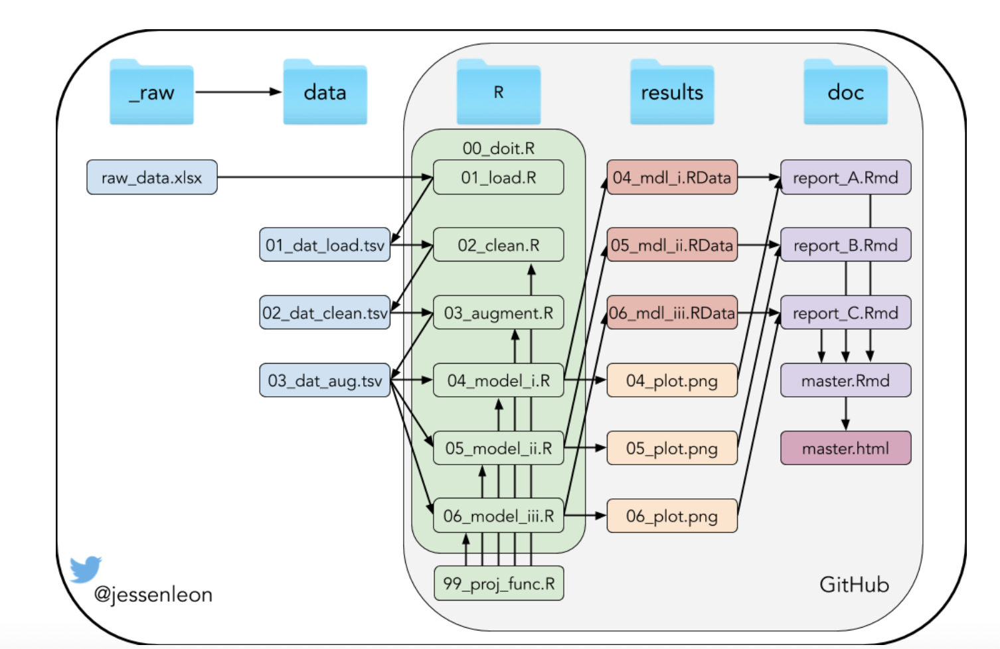

```{r setup, include=FALSE}
knitr::opts_chunk$set(echo = FALSE)
```
## Content

* Introduction
* Methods
  - Project overview
  - Data
* Results
* Conclusion

## Introduction
Prediction of protein-protein interactions (PPI) are a challenging task. 

ML models allow to exploit the content of these PPI data sets. 

The aim of this project is to create a toolbox to predict the biological activity of these peptides with machine learning models. 

* Features:
  - Support for both sequence or variant input.
  - Support for several sequence encoders.
  - Support for several models.
  - Visualization options.
  
## Project overview {.centered}
[Visit our Github repository](https://github.com/rforbiodatascience/2020_group03)

{width=75%}

## Methods - packages used
| Function                    | Library                                                    |
| --------------------------- | ---------------------------------------------------------- |
| Data loading                | `readxl`                                                   |
| Data cleaning and wrangling | `dplyr` (`tidyverse`)                                      |
| Data augmenting             | `dplyr` (`tidyverse`),`Peptides`                           |
| Extracting data             | `UniprotR`                                                 |
| Plotting                    | `ggplot2`(`tidyverse`), `ggseqlogo`                        |
| Modeling                    | `keras`,`neuralnet`, `caret`, `yardstick`, `glmnet`,`ANN2` |

## Methods - the data sets

|            | Protein | Target                     | Biological activity    | Species         | Num of variants | Score                                                     |
| ---------- | ------- | -------------------------- | ---------------------- | --------------- | --------------- | --------------------------------------------------------- |
| Data set 1 | BRCA1   | BARD1 RING domain          | Ubiquitin E3 activity  | *H. sapiens*    | 5610            | Y2H assays                                                |
| Data set 2 | ERK2    | Small molecule (SCH772984) | Resistance to drugs    | *H. sapiens*    | 6810            | Drug sensitivity assays. Calculation of cell availability |
| Data set 3 | LDLRAP1 | OBFC1                      | Protein translation    | *H. sapiens*    | 6385            | Y2H assays                                                |
| Data set 4 | Pab1    | el4FG1                     | Translation initiation | *S. cereviseae* | 1340            | Y2H assays                                                |

## Example data set 4 - data overview

<div class="columns-2">
 {width=100%}
  <p class="forceBreak">
     </p>
   {width=100%}
</div>

## Example dataset 4 - heatmap
{width=70%}
{width=70%}

## Example dataset 4 - conserved regions
{width=100%}

## Machine learning toolbox

* Ideas for supported machine learning framework:

  - Gaussian Process Regression.
  - Artificial Neutral Network.
  - ElasticNet Regression.


## Results

## Conclusion

## Referencex

<div class="columns-2">
  {width=300px}
  <p class="forceBreak"></p>

  * <font size="3">**Data set 1**: L. M. Starita,  D. L. Young, et al. *Massively parallel functional analysis of brca1 ring domainvariants*, Genetics, vol. 200, no. 2, pp. 413–422, 2015.  </font>
  * <font size="3">**Data set 2**:  L. Brenan, A. Andreev, et al. *Phenotypic  characterization  of  a  comprehensive  set  of missense mutants*. Cell Reports, vol. 17, no. 4, pp. 1171–1183, 2016.  </font>
  * <font size="3">**Data set 3**: A deep mutational scan of LDLRAP1 based on a Y2H assay with the interactor OBFC1. [https://www.mavedb.org/scoreset/urn:mavedb:00000036-a-1/]   </font>
  * <font size="3">**Data set 4**: D. Melamed, D. L. Young, et al. *Combining natural sequence variation withhigh throughput mutational data to reveal protein interaction sites*. PLOS Genetics, vol. 11, no. 2,pp. 1–21, 2015.  </font>
</div>

## Appendix
### R script overview 1

<div class="columns-2">
  ```

  ```
  <p class="forceBreak"></p>
  * 02_clean.R
    - Load: Load data from 01_load.R
    - Wrangle data: Remove NaN, fixes
    - Save cleansed data in .tsv format
  * 03_augment.R
    - Load data from 02_clean.R
    - Augment data: Calculate sequences, descriptors, properties
    - Save augmente data in .tsv format
</div>

## Appendix   
### R script overview 2

<div class="columns-2">

  <p class="forceBreak"></p>
  * 04_model_i.R
    - Load augmented data
    - Perform model fitting
    - Predict unknowns
    - Plotting and reporting
</div>

## Appendix
### R script overview 3

<div class="columns-2">
  {width=500px}
  <p class="forceBreak"></p>
  * 99_proj_func.R
    - Sequence encoder
    - Sequence generator
    - ...
</div>