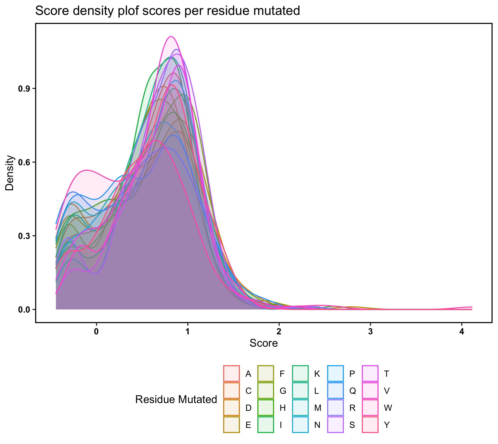
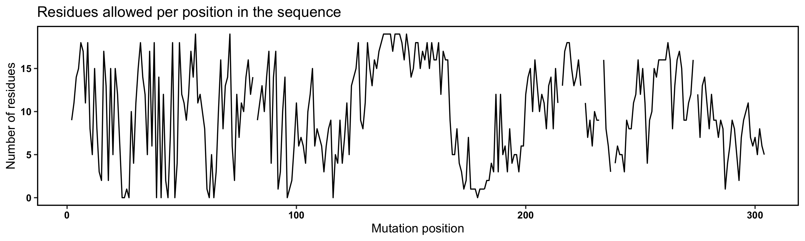

```{r setup, include=FALSE}
knitr::opts_chunk$set(echo = FALSE)
```

<style>
.forceBreak { -webkit-column-break-after: always; break-after: column; }
</style>

<style>
div.footnotes {
  position: absolute;
  bottom: 0;
  margin-bottom: 10px;
  width: 80%;
  font-size: 0.6em;
}
</style>


## Project aims

* Produce R script machine learning toolbox for protein and peptide bio-activities.
* Features:
  - Support for both sequence or variant input.
  - Support for several sequence encoders.
  - Support for sequence based calculations.
  - Support for several models.
  - Visualization options.

## Example dataset 2 - data overview
<div class="columns-2">
  {width=100%}
  <p class="forceBreak"></p>
  {width=100%}
</div>


## Example dataset 1 - heatmap
{width=100%}

</div>
{width=100%}
  
## R script overview 2

<div class="columns-2">
  {width=500px}
  <p class="forceBreak"></p>
  * 02_clean.R
    - Load: Load data from 01_load.R
    - Wrangle data: Remove NaN, fixes
    - Save cleansed data in .tsv format
  * 03_augment.R
    - Load data from 02_clean.R
    - Augment data: Calculate sequences, descriptors, properties
    - Save augmente data in .tsv format
</div>
    
## R script overview 3

<div class="columns-2">
  {width=500px}
  <p class="forceBreak"></p>
  * 04_model_i.R
    - Load augmented data
    - Perform model fitting
    - Predict unknowns
    - Plotting and reporting
</div>

## R script overview 4

<div class="columns-2">
  {width=500px}
  <p class="forceBreak"></p>
  * 99_proj_func.R
    - Sequence encoder
    - Sequence generator
    - ...
</div>

## Data peptide and protein data sources

* Ideas for sequence / variant effects:
  - https://www.mavedb.org/ is a public repository for datasets from Multiplexed Assays of Variant Effect (MAVEs), such as those generated by deep mutational scanning (DMS) or massively parallel reporter assay (MPRA) experiments. RESTful API.
  - Other scientific litterature...

* Ideas for sequence encoding matrices
  - BLOSUM - Physicochemical and substitution matrix
  - Z-scales - Physicochemical
  - T-scales - Topological
  - MSWHIM - 3D electrostatic potential

## Machine learning toolbox

* Ideas for supported machine learning framework:

  - Gaussian Process Regression.
  - Artificial Neutral Network.
  - ElasticNet Regression.

## Distribution of tasks, week 18

* Laura: Descriptors and function for translating, data visualization / exploration
* Jacob: Sequence generation
* Felix, Begoña: Machine learning tool boox

* Project state EOW - functional preprocessing, first steps with machine learning toolbox

## Distribution of tasks, week 19


## Content
* Introduction
* Methods
* Results
* Discussion
* Conclusion

## Introduction

## Methods

## Results

## Discussion

## Conclusion
