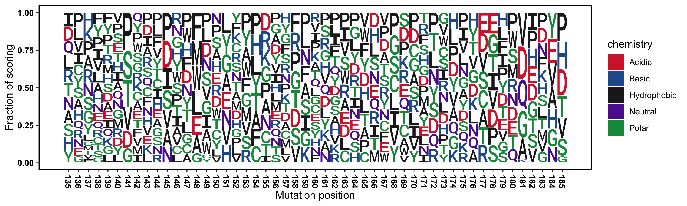
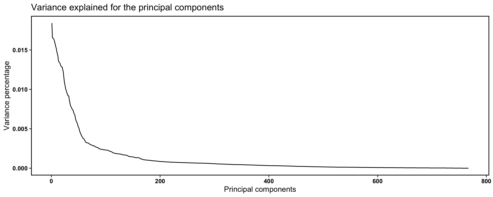
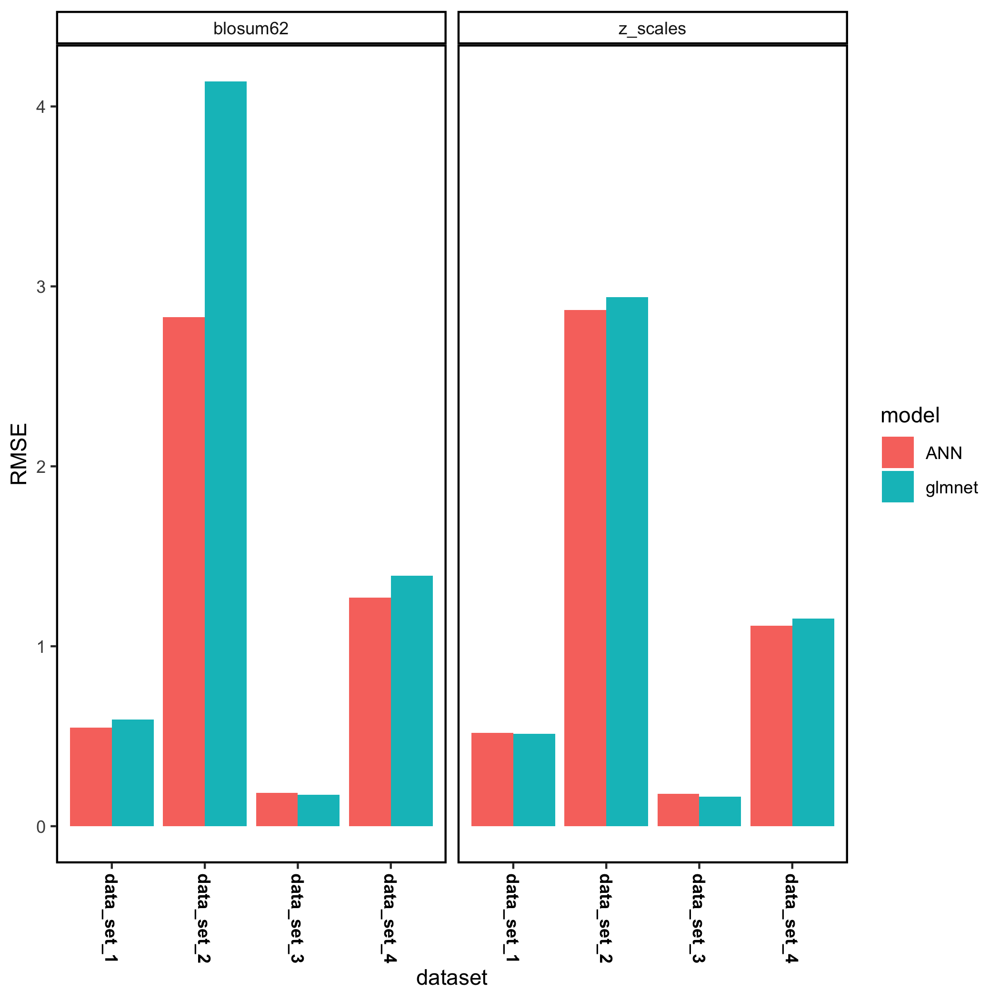
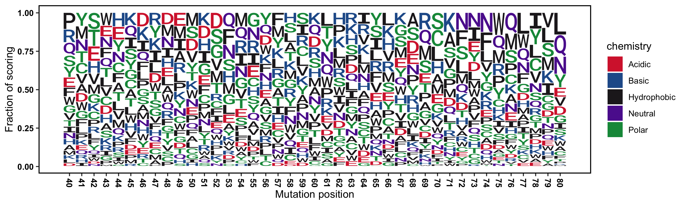

```{r setup, include=FALSE}
knitr::opts_chunk$set(echo = FALSE)
```
## Content of this presentation
* Introduction to the project
* Project overview
* Methods used
* Results
* Discussion
* Conclusion


## Introduction
* Prediction of protein-protein interactions (PPI) are a challenging task. 
* Machine learning (ML) models allow to exploit the content of PPI data sets generated by deep mutational scanning.
* The aim of this project is to create a toolbox for generating structure-function insights using visualization tools and subsequently allow for predictions the biological activity of proteins and peptides using ML models. 
* Features of the toolbox:
  - Input and output data Visualization options.
  - Support for both sequence or variant input.
  - Support for several sequence encoders.
  - Support for several models.


## Project workflow


## Project overview {.centered}
[Visit our Github repository](https://github.com/rforbiodatascience/2020_group03)
{width=75%}


## Deep mutational scanning
* Deep mutational scanning allows for assessing the functional consequences of up to hundreds of thousands of variants of a protein in a single experiment.

* It combines high-throughput DNA sequencing with a selection in which a physical association is maintained between each protein variant and the DNA that encodes it.

* The sequence analysis provides the frequency of each variant in an input population and in a population after selection, with this ratio serving as a proxy for the function of each variant.


## Methods - the data sets

|            | Protein | Target                     | Biological activity    | Species         | Num of variants | Score                                                     |
| ---------- | ------- | -------------------------- | ---------------------- | --------------- | --------------- | --------------------------------------------------------- |
| Data set 1 | BRCA1   | BARD1 RING domain          | Ubiquitin E3 activity  | *H. sapiens*    | 5610            | Y2H assays                                                |
| Data set 2 | ERK2    | Small molecule (SCH772984) | Resistance to drugs    | *H. sapiens*    | 6810            | Drug sensitivity assays. Calculation of cell availability |
| Data set 3 | LDLRAP1 | OBFC1                      | Protein translation    | *H. sapiens*    | 6385            | Y2H assays                                                |
| Data set 4 | Pab1    | el4FG1                     | Translation initiation | *S. cereviseae* | 1340            | Y2H assays                                                |


## This presentation
* In this presentation we focus on a particular dataset; data set 4 concerning deep mutatagenesis of Pab1.
* We did however run all four data sets through the pipeline to verify the generality of the workflow and to see if some amino acid decriptors are better than others depending on the protein function.


## Methods - packages used
| Function                    | Library                                                    |
| --------------------------- | ---------------------------------------------------------- |
| Data loading                | `readxl`                                                   |
| Data cleaning and wrangling | `dplyr` , `broom` (`tidyverse`)                            |
| Data augmenting             | `dplyr` (`tidyverse`),`Peptides`                           |
| Extracting data             | `UniprotR`                                                 |
| Plotting                    | `ggplot2`(`tidyverse`), `ggseqlogo`,`ggpubr`               |
| Analysing                   | `stats`                                                    |
| Modeling                    | `keras`,`neuralnet`, `caret`, `yardstick`, `glmnet`,`ANN2` |


## Score densities for Pab1 RRM2 domain variants
<div class="columns-2">
{width=100%}
<p class="forceBreak"></p>
{width=100%}
</div>


## Residues allowed in Pabl1 RRM2 domain
An amino acid was counted as active if score >0.

{width=100%}


## Heatmap of Pabl1 RRM2 domain variant scores
The scoring scale was truncated to between -2...2.

{width=100%}


## Sequence logo of Pabl1 RRM2 domain(135-185) variant scores
The score was normalized and summed to 1 for each postion.

{width=100%}


## Machine learning toolbox

* Supported machine learning framework:

  - Artificial Neutral Network (ANN) regression.
  - Regularized linear regression.

## Amino acid encoding

* In order to present the protein sequences to the ML framework we used amino acids descriptors.
 * Each amino acid residue is converted to a vector and each protein as concatenation of vectors to yield a highly dimentional vector representation.
 * The following amino acid scales are available:
 
| Scale(s)  | Description of scale                                         |
| -------- | ------------------------------------------------------------ |
| blosum45,50,62,80,90 | Substitution matrix based on VARIMAX analysis of physicochemical properties |
| pam30,70,250    | Substitution matrix based on observed mutations in phylogenetic trees |
| z5_scales | PCA of physicochemical properties                            |


## Principal component analysis (PCA) showed around 200 components needed
{width=100%}


## Artificial Neural Network with Keras
{width=75%}


## Cross validation of a Pabl1 RRM2 glmnet model with z_scale
<div class="columns-2">
{width=100%}
<p class="forceBreak"></p>
{width=100%}
</div>


## Prediction of unknown Pabl1 RRM2 variants with glmnet and z_scales
{width=95%}


## Discussion and model comparison for all four data sets 1

<div class="columns-2">

* For all four data sets we compared ANN and glmnet regression (ElasticNet) on two amino acid descriptor scales; z_scales and blosum62.
* We found the model performance (meassured as RMSE) for the test sets to be comparable across both scales and regressor - except for data set 2 where ANN seemed to perform better than glmnet.

<p class="forceBreak"></p>
{width=100%}
</div>


## Discussion and model comparison for all four data sets 2
 * The ANN with keras was performed for all 4 data set obtaining a really low accuracy for all of them. It was necessary to downsize the datasets, taking 1/4 of the sequence, in order to obtain a final model in each case.
 * The models performance is not impressive. Most likely other model types such as gaussian process regression or more advanced neural networks might be needed.
 * None the less we were able to predict the missing variant for data set 4 using the glmnet regressor which we implemented in a shiny app.


## Challenges
* RStudio Cloud is limited in memory! We had a lot of crashes both with keras, ANN2 and glmnet in the cloud.
* All modelling and predications of full scale data set are possible using a local RStudio installation using the idendicated libraries.
* On the other hand we had problem with local keras installations hence the need for ANN2 and glmnet.
 

## Conclusion
 * Visualization of the raw data provided insights into the SAR of the 4 proteins.
 * We are able to find regions in the proteins which are both sensitive and insensitive to substitutions.
 * The heatmap shows quite that a substantial part of the C-terminal region studied was not very well covered in the scanning.
 * Using machine learning based on amino acid descriptors we were able to generate predictive models


## References

<div class="columns-2">
  {width=300px}
  <p class="forceBreak"></p>

  * <font size="3">**Data set 1**: L. M. Starita,  D. L. Young, et al. *Massively parallel functional analysis of brca1 ring domainvariants*, Genetics, vol. 200, no. 2, pp. 413–422, 2015.  </font>
  * <font size="3">**Data set 2**:  L. Brenan, A. Andreev, et al. *Phenotypic  characterization  of  a  comprehensive  set  of missense mutants*. Cell Reports, vol. 17, no. 4, pp. 1171–1183, 2016.  </font>
  * <font size="3">**Data set 3**: A deep mutational scan of LDLRAP1 based on a Y2H assay with the interactor OBFC1. [https://www.mavedb.org/scoreset/urn:mavedb:00000036-a-1/]   </font>
  * <font size="3">**Data set 4**: D. Melamed, D. L. Young, et al. *Combining natural sequence variation withhigh throughput mutational data to reveal protein interaction sites*. PLOS Genetics, vol. 11, no. 2,pp. 1–21, 2015.  </font>
</div>

## References
 * Amino acid substition matrices: https://www.ncbi.nlm.nih.gov/IEB/ToolBox/C_DOC/lxr/source/data/
 
 * z_scales: https://pubs.acs.org/doi/10.1021/jm9700575


## Score density collection
<div class="columns-2">
{width=70%}
{width=70%}
<p class="forceBreak"></p>
{width=70%}
{width=70%}
</div>


## Heatmap collection
<div class="columns-2">
{width=100%}
{width=100%}
<p class="forceBreak"></p>
{width=100%}
{width=100%}
</div>


## Sequence logo collection
<div class="columns-2">
{width=100%}
{width=100%}
<p class="forceBreak"></p>
{width=100%}
{width=100%}
</div>


## Residues allowed collection
<div class="columns-2">
{width=100%}
{width=100%}
<p class="forceBreak"></p>
{width=100%}
{width=100%}
</div>


## Appendix
### R script overview 1

<div class="columns-2">
{width=500px}
  <p class="forceBreak"></p>
  * 02_clean.R
    - Load: Load data from 01_load.R
    - Wrangle data: Remove NaN, fixes
    - Save cleansed data in .tsv format
  * 03_augment.R
    - Load data from 02_clean.R
    - Augment data: Calculate sequences, descriptors (pI, MW, Z-Scale)
    - Save augmented data in .tsv format
</div>

## Appendix   
### R script overview 2

<div class="columns-2">
{width=500px}
  <p class="forceBreak"></p>
  * 04_model_i.R
    - Load augmented data
    - Perform model fitting
    - Predict unknowns
    - Plotting and reporting
</div>

## Appendix
### R script overview 3

<div class="columns-2">
  {width=500px}
  <p class="forceBreak"></p>
  * 99_proj_func.R
    - Sequence encoder
    - Sequence generator
    - Plot functions
</div>
